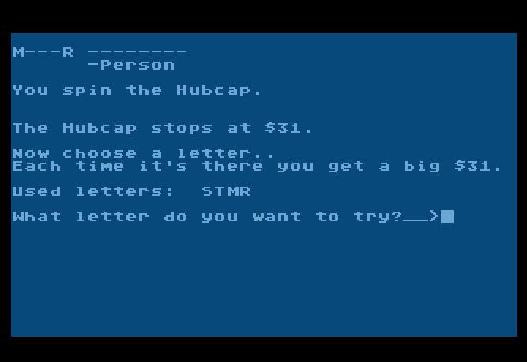

# Hubcap of Fortune
Hubcap of Fortune, a Wheel of Fortune game that I wrote for Atari 8-bit computers in Atari BASIC, circa 1988

I wrote this to be played online by callers of Weird City BBS. 

There are some references to the Weird Al Song "Vanna Pick Me A Letter." Listening to that is a better use of three minutes than looking at this terrible code.
